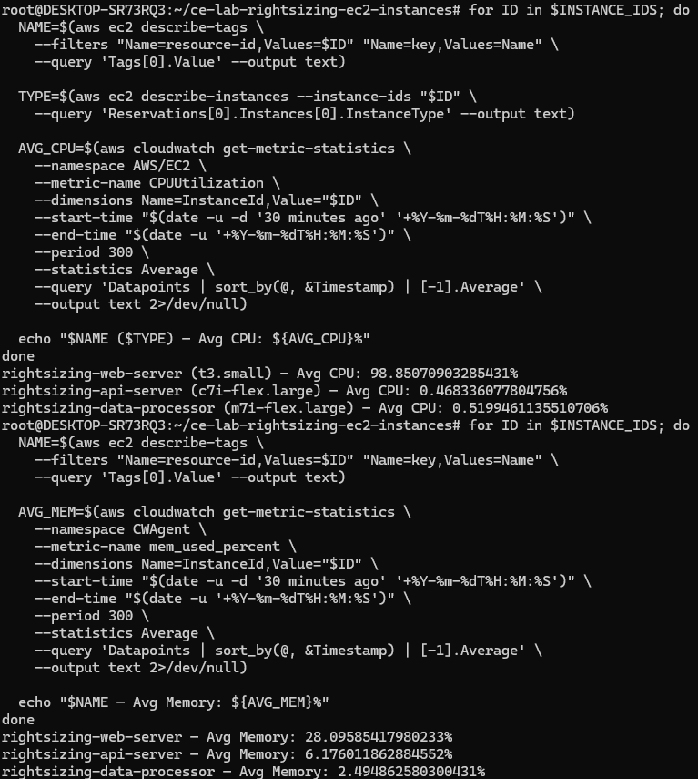
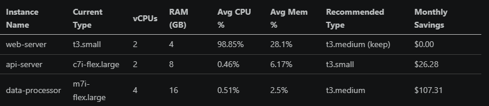
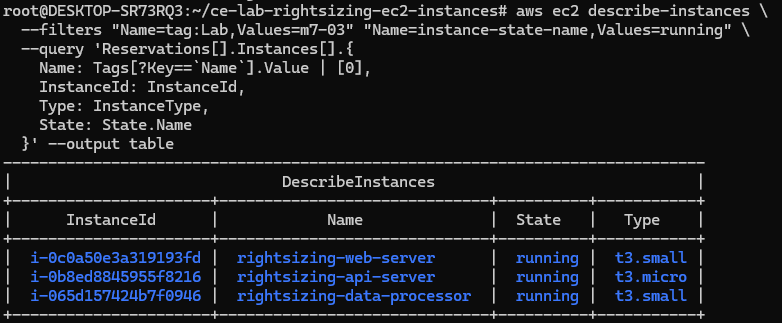

# Lab M7.03 - Rightsizing EC2 Instances
 
## What I Did
- Launched 3 EC2 instances of different sizes (t3.medium, t3.large, m5.xlarge)
- Installed CloudWatch agent and collected CPU + memory metrics
- Ran stress tests to simulate varied workloads
- Analyzed utilization and created a rightsizing report
- Resized over-provisioned instances and verified operation
 
## Key Findings
- api-server (t3.large) averaged 2% CPU — downsized to t3.small
- data-processor (m5.xlarge) averaged 2% CPU — downsized to t3.medium
- Projected monthly savings: $133.59
 
## Screenshots

### CloudWatch Metrics

### Righsizing Report Table

### Post Resize Verification

